# 🏗️ System Architecture Documentation

## 📋 **Overview**

This document describes the professional architecture of the Smart Code Review Pipeline, a TRUE Parallel Multi-Agent System designed with simultaneous agent execution, LangGraph orchestration, and comprehensive code analysis capabilities.

## 🎯 **Design Principles**

### **1. Separation of Concerns**
- **Core**: Configuration and state management
- **Agents**: Specialized analysis logic (Security, Quality, Coverage, AI Review, Documentation)
- **Services**: External integrations (GitHub, Gemini, Email, PyLint, Coverage)
- **Workflows**: LangGraph orchestration logic
- **Analyzers**: Analysis components and algorithms
- **Utils**: Shared utilities and error handling
- **Models**: Data structures and state schemas

### **2. Dependency Injection**
- Services are injected into agents
- No tight coupling between components
- Easy to test and mock
- Configurable service endpoints

### **3. Interface Standardization**
- All agents inherit from `BaseAgent`
- Consistent error handling patterns
- Standardized logging approach
- Uniform state management

### **4. TRUE Parallel Processing**
- All 5 agents execute simultaneously using LangGraph
- No sequential bottlenecks
- Maximum efficiency and speed
- Resilient to individual agent failures

## 📁 **Directory Structure**

```
Multi-Agent-Code-Review-Pipeline-LangGraph-Refactor/
├── smart_code_review/          # Main package
│   ├── __init__.py            # Package initialization
│   ├── main.py                # Application entry point
│   ├── README.md              # Package documentation
│   │
│   ├── core/                  # Core system components
│   │   ├── __init__.py        # Package initialization
│   │   ├── config.py          # Configuration management
│   │   └── state.py           # State management functions
│   │
│   ├── agents/                # Specialized agent implementations
│   │   ├── __init__.py        # Package exports
│   │   ├── base_agent.py      # Abstract base class
│   │   ├── pr_detector.py     # PR detection and parsing
│   │   ├── security_agent.py  # Security vulnerability analysis
│   │   ├── quality_agent.py   # PyLint code quality analysis
│   │   ├── coverage_agent.py  # Test coverage analysis
│   │   ├── ai_review_agent.py # Gemini AI-powered review
│   │   ├── documentation_agent.py # Documentation analysis
│   │   └── agent_coordinator.py # Result aggregation
│   │
│   ├── services/              # External service integrations
│   │   ├── __init__.py        # Package initialization
│   │   ├── gemini/            # Gemini AI service
│   │   │   ├── __init__.py    # Service exports
│   │   │   ├── client.py      # AI client implementation
│   │   │   ├── prompts.py     # AI prompts and templates
│   │   │   └── parser.py      # Response parsing logic
│   │   ├── github/            # GitHub API service
│   │   │   ├── __init__.py    # Service exports
│   │   │   ├── client.py      # GitHub API client
│   │   │   └── models.py      # GitHub data models
│   │   ├── email_service.py   # Email notification service
│   │   ├── pylint_service.py  # PyLint integration service
│   │   ├── coverage_service.py # Coverage analysis service
│   │   └── gemini_service.py  # Legacy Gemini service wrapper
│   │
│   ├── workflows/             # LangGraph workflow definitions
│   │   ├── __init__.py        # Package exports
│   │   └── parallel_workflow.py # Main workflow orchestration
│   │
│   ├── analyzers/             # Analysis components
│   │   ├── __init__.py        # Package exports
│   │   ├── security_analyzer.py # Security vulnerability detection
│   │   ├── code_complexity.py # Code complexity analysis
│   │   ├── test_quality.py    # Test quality analysis
│   │   └── documentation_analyzer.py # Documentation analysis
│   │
│   ├── utils/                 # Utility functions
│   │   ├── __init__.py        # Package exports
│   │   ├── logging_utils.py   # Logging configuration
│   │   ├── validation.py      # Input validation
│   │   ├── formatters.py      # Output formatting utilities
│   │   └── error_handling.py  # Error handling utilities
│   │
│   ├── models/                # Data models and schemas
│   │   ├── __init__.py        # Package exports
│   │   └── review_state.py    # Review state model
│   │
│   └── visualization/         # Visualization components (future)
│       └── __init__.py        # Package placeholder
│
├── logs/                      # Log files (created at runtime)
├── main.py                    # Wrapper entry point
├── demo_sample.py            # Sample code for testing
├── tests.py                  # Comprehensive test suite
├── requirements.txt          # Python dependencies
├── setup.py                  # Package setup configuration
├── .env                      # Environment configuration
├── README.md                 # User documentation
└── ARCHITECTURE.md           # This file
```

## 🔄 **Component Interactions**

### **1. Workflow Orchestration**
```
main.py → smart_code_review/main.py → workflows/parallel_workflow.py → agents/* → services/*
```

### **2. Agent Execution Pattern**
```
BaseAgent.execute() → Agent.process() → Service calls → State update → Completion tracking
```

### **3. Service Integration**
```
Agent → Service Client → External API/System → Response Processing → Result formatting
```

### **4. TRUE Parallel Flow**
```
PR Detector → [Security + Quality + Coverage + AI Review + Documentation] → Coordinator → Decision → Report
```

## 🤖 **Agent Architecture**

### **Base Agent Pattern**
All agents inherit from `BaseAgent` which provides:
- Standardized execution flow with error handling
- Automatic completion tracking
- Consistent logging patterns
- State management helpers
- Graceful failure recovery

### **Agent Lifecycle**
1. **Initialization**: Agent created with name and logger
2. **Execution**: `execute()` method called with state
3. **Processing**: Agent-specific `process()` method
4. **Service Integration**: External service calls
5. **State Update**: Results merged into workflow state
6. **Completion**: Agent marked as completed in `agents_completed` list

### **Error Handling Strategy**
- **Graceful Degradation**: Workflow continues with partial results
- **Detailed Error Logging**: Comprehensive error information captured
- **Agent Isolation**: One agent failure doesn't stop others
- **Fallback Results**: Empty results provided on failure
- **Human Escalation**: Critical failures trigger escalation

## 🔧 **Service Architecture**

### **Service Abstraction Layers**

#### **🔒 GitHub Service**
- **Purpose**: Pull request data retrieval and file content access
- **Features**: PR details, file changes, diff analysis, branch information
- **Error Handling**: Rate limiting, authentication failures, network issues
- **Configuration**: Token-based authentication, configurable API endpoints

#### **🤖 Gemini AI Service**
- **Purpose**: AI-powered code analysis and review generation
- **Features**: Code review, PR summaries, security enhancements, documentation improvements
- **Integration**: Gemini 2.0 Flash model with streaming responses
- **Context Awareness**: Uses results from other agents for enhanced analysis

#### **📧 Email Service**
- **Purpose**: Automated notification system
- **Features**: SMTP integration, HTML email templates, attachment support
- **Notifications**: Review started, analysis complete, final reports, error alerts
- **Security**: TLS encryption, credential management

#### **🔍 PyLint Service**
- **Purpose**: Static code analysis and quality scoring
- **Features**: Code quality metrics, style checking, complexity analysis
- **Integration**: PyLint library with custom configuration
- **Output**: Detailed reports with scores and recommendations

#### **🧪 Coverage Service**
- **Purpose**: Test coverage analysis and reporting
- **Features**: Coverage percentage calculation, missing test identification
- **Integration**: Coverage.py library with pytest integration
- **Metrics**: Line coverage, branch coverage, function coverage

### **Service Benefits**
- **Testability**: Easy to mock for unit testing
- **Consistency**: Uniform error handling across services
- **Configurability**: Environment-specific settings
- **Reliability**: Retry logic and timeout handling
- **Scalability**: Connection pooling and rate limiting

## 📊 **State Management**

### **State Flow Architecture**
1. **Initial State**: Created by `StateManager.create_initial_state()`
2. **PR Detection**: PR details and file data populated
3. **Parallel Agent Updates**: Each agent adds results concurrently
4. **Coordination**: Coordinator aggregates all results
5. **Decision Making**: Decision maker analyzes combined state
6. **Report Generation**: Final report created with all results
7. **Completion**: Workflow marked as complete

### **State Structure Schema**
```python
ReviewState = {
    # Core review information
    "review_id": "REV-20241220-ABC123",
    "repo_owner": "username",
    "repo_name": "repository",
    "pr_number": 123,
    "timestamp": "2024-12-20 10:30:00",
    
    # PR details
    "pr_details": {
        "title": "Feature: Add new functionality",
        "author": "developer",
        "head_branch": "feature-branch",
        "base_branch": "main",
        "state": "open",
        "created_at": "2024-12-20 09:00:00",
        "updated_at": "2024-12-20 10:00:00"
    },
    
    # File data
    "files_data": [
        {
            "filename": "src/module.py",
            "status": "modified",
            "additions": 50,
            "deletions": 10,
            "changes": 60,
            "content": "file content..."
        }
    ],
    
    # Agent results (populated in parallel)
    "security_results": [
        {
            "filename": "src/module.py",
            "security_score": 8.5,
            "vulnerabilities": [...],
            "severity_counts": {"HIGH": 0, "MEDIUM": 1, "LOW": 2},
            "recommendations": [...]
        }
    ],
    
    "pylint_results": [
        {
            "filename": "src/module.py",
            "score": 7.8,
            "total_issues": 5,
            "issues_by_category": {...},
            "recommendations": [...]
        }
    ],
    
    "coverage_results": [
        {
            "filename": "src/module.py",
            "coverage_percent": 85.0,
            "missing_lines": [45, 67, 89],
            "test_recommendations": [...]
        }
    ],
    
    "ai_reviews": [
        {
            "filename": "src/module.py",
            "overall_score": 0.85,
            "suggestions": [...],
            "code_quality": {...},
            "security_context": {...}
        }
    ],
    
    "documentation_results": [
        {
            "filename": "src/module.py",
            "documentation_coverage": 75.0,
            "missing_docstrings": [...],
            "quality_score": 8.0
        }
    ],
    
    # Coordination and decision
    "agents_completed": ["security", "quality", "coverage", "ai_review", "documentation"],
    "decision_metrics": {
        "security_score": 8.5,
        "pylint_score": 7.8,
        "coverage": 85.0,
        "ai_score": 0.85,
        "documentation_coverage": 75.0,
        "high_severity_issues": 0
    },
    
    # Decision results
    "has_critical_issues": False,
    "critical_reason": "",
    "decision": "auto_approve",
    
    # Final report
    "report": {
        "decision": "auto_approve",
        "recommendation": "AUTO APPROVE",
        "priority": "MEDIUM",
        "metrics": {...},
        "key_findings": [...],
        "action_items": [...],
        "approval_criteria": [...]
    },
    
    # Control flow
    "stage": "report_complete",
    "next": "end",
    "workflow_complete": True,
    "emails_sent": [...]
}
```

## 🚀 **Workflow Orchestration**

### **TRUE Parallel Multi-Agent Workflow Diagram**

```mermaid
graph TD
    %% Entry Point
    START([🚀 Workflow Start]) --> PR_DETECTOR[🔍 PR Detector Agent]
    
    %% PR Detection and Setup
    PR_DETECTOR --> |"Parse PR Details<br/>Extract File Data<br/>Send Alert Email"| PARALLEL{"🎯 Launch Parallel Agents"}
    
    %% TRUE Parallel Agent Execution (All 5 agents run simultaneously)
    PARALLEL --> |"Simultaneously"| SECURITY[🔒 Security Analysis Agent]
    PARALLEL --> |"Simultaneously"| QUALITY[📊 Quality Analysis Agent]
    PARALLEL --> |"Simultaneously"| COVERAGE[🧪 Coverage Analysis Agent]
    PARALLEL --> |"Simultaneously"| AI_REVIEW[🤖 AI Review Agent]
    PARALLEL --> |"Simultaneously"| DOCUMENTATION[📚 Documentation Agent]
    
    %% Agent Specializations and Results
    SECURITY --> |"17+ Vulnerability Patterns<br/>Security Score: 0-10<br/>Severity Classification"| SEC_RESULT[🔒 Security Results<br/>Score: 8.5/10<br/>Vulnerabilities: 3 LOW<br/>Recommendations: 5]
    
    QUALITY --> |"PyLint Integration<br/>Code Quality Metrics<br/>Style & Complexity"| QUAL_RESULT[📊 Quality Results<br/>PyLint Score: 7.8/10<br/>Issues: 5 Found<br/>Categories: Style, Convention]
    
    COVERAGE --> |"Test Coverage Analysis<br/>Missing Test Detection<br/>Coverage.py Integration"| COV_RESULT[🧪 Coverage Results<br/>Coverage: 85%<br/>Missing Lines: 3<br/>Test Gaps: Identified]
    
    AI_REVIEW --> |"Gemini 2.0 Flash<br/>Context-Aware Analysis<br/>Cross-Agent Integration"| AI_RESULT[🤖 AI Review Results<br/>Confidence: 85%<br/>Suggestions: 8<br/>Context: Multi-Agent]
    
    DOCUMENTATION --> |"Docstring Analysis<br/>API Documentation<br/>Coverage Assessment"| DOC_RESULT[📚 Documentation Results<br/>Coverage: 75%<br/>Missing: 3 Functions<br/>Quality: Good]
    
    %% Agent Coordination
    SEC_RESULT --> COORDINATOR[🎯 Agent Coordinator]
    QUAL_RESULT --> COORDINATOR
    COV_RESULT --> COORDINATOR
    AI_RESULT --> COORDINATOR
    DOC_RESULT --> COORDINATOR
    
    %% Coordination Logic
    COORDINATOR --> |"All 5 Agents Complete?"| CHECK{"✅ All Agents<br/>Completed?"}
    CHECK --> |"No - Wait"| WAIT[⏳ Wait for<br/>Remaining Agents]
    WAIT --> CHECK
    CHECK --> |"Yes - Proceed"| SUMMARY[📋 Generate<br/>Multi-Agent Summary]
    
    %% Decision Making with Quality Thresholds
    SUMMARY --> DECISION{"⚖️ Decision Maker<br/>Quality Gate Analysis"}
    
    %% Multi-Dimensional Decision Matrix
    DECISION --> |"Security Score < 8.0<br/>OR High Severity Issues"| ESCALATE_SEC[🔴 Critical Escalation<br/>Security Vulnerabilities]
    DECISION --> |"PyLint Score < 7.0<br/>Code Quality Issues"| ESCALATE_QUAL[🟡 Human Review<br/>Quality Below Threshold]
    DECISION --> |"Coverage < 80%<br/>Insufficient Testing"| ESCALATE_COV[🟡 Human Review<br/>Low Test Coverage]
    DECISION --> |"AI Confidence < 0.8<br/>Uncertain Analysis"| ESCALATE_AI[🟡 Human Review<br/>Low AI Confidence]
    DECISION --> |"Documentation < 70%<br/>Poor Documentation"| ESCALATE_DOC[🟡 Documentation Review<br/>Missing Documentation]
    DECISION --> |"All Thresholds Met<br/>Quality Gates Passed"| AUTO_APPROVE[✅ Auto-Approve<br/>All Criteria Met]
    
    %% Final Communication Paths
    AUTO_APPROVE --> COMM_SUCCESS[📧 Communicator Agent<br/>Approval Report]
    ESCALATE_SEC --> COMM_CRITICAL[📧 Communicator Agent<br/>Critical Security Alert]
    ESCALATE_QUAL --> COMM_REVIEW[📧 Communicator Agent<br/>Human Review Request]
    ESCALATE_COV --> COMM_REVIEW
    ESCALATE_AI --> COMM_REVIEW
    ESCALATE_DOC --> COMM_DOC[📧 Communicator Agent<br/>Documentation Review]
    
    %% Email Notifications Throughout Workflow
    PR_DETECTOR --> EMAIL1[📧 PR Analysis Started]
    SEC_RESULT --> EMAIL2[📧 Security Analysis Complete]
    QUAL_RESULT --> EMAIL3[📧 Quality Analysis Complete]
    COV_RESULT --> EMAIL4[📧 Coverage Analysis Complete]
    AI_RESULT --> EMAIL5[📧 AI Review Complete]
    DOC_RESULT --> EMAIL6[📧 Documentation Analysis Complete]
    AUTO_APPROVE --> EMAIL7[📧 Auto-Approval Notification]
    ESCALATE_SEC --> EMAIL8[📧 Critical Security Alert]
    
    %% Final States
    COMM_SUCCESS --> END_SUCCESS([🟢 AUTO-APPROVED<br/>PR Ready for Merge])
    COMM_CRITICAL --> END_CRITICAL([🔴 CRITICAL ESCALATION<br/>Security Review Required])
    COMM_REVIEW --> END_REVIEW([🟡 HUMAN REVIEW<br/>Manual Review Required])
    COMM_DOC --> END_DOC([🟡 DOCUMENTATION REVIEW<br/>Documentation Needed])
    
    %% Error Handling
    PR_DETECTOR --> |"Error"| ERROR[❌ Error Handler]
    SECURITY --> |"Error"| ERROR
    QUALITY --> |"Error"| ERROR
    COVERAGE --> |"Error"| ERROR
    AI_REVIEW --> |"Error"| ERROR
    DOCUMENTATION --> |"Error"| ERROR
    COORDINATOR --> |"Error"| ERROR
    ERROR --> END_ERROR([🔴 ERROR<br/>System Failure])
    
    %% Styling with Black Text
    classDef agentNode fill:#e1f5fe,stroke:#01579b,stroke-width:2px,color:#000000
    classDef resultNode fill:#f3e5f5,stroke:#4a148c,stroke-width:2px,color:#000000
    classDef decisionNode fill:#fff3e0,stroke:#e65100,stroke-width:2px,color:#000000
    classDef criticalNode fill:#ffebee,stroke:#c62828,stroke-width:3px,color:#000000
    classDef successNode fill:#e8f5e8,stroke:#2e7d32,stroke-width:2px,color:#000000
    classDef errorNode fill:#fce4ec,stroke:#ad1457,stroke-width:2px,color:#000000
    classDef emailNode fill:#fff9c4,stroke:#f57f17,stroke-width:1px,color:#000000
    classDef defaultNode fill:#f9f9f9,stroke:#333333,stroke-width:2px,color:#000000
    
    class SECURITY,QUALITY,COVERAGE,AI_REVIEW,DOCUMENTATION agentNode
    class SEC_RESULT,QUAL_RESULT,COV_RESULT,AI_RESULT,DOC_RESULT resultNode
    class DECISION,CHECK decisionNode
    class ESCALATE_SEC,ESCALATE_QUAL,ESCALATE_COV,ESCALATE_AI,ESCALATE_DOC,END_CRITICAL,END_REVIEW,END_DOC criticalNode
    class AUTO_APPROVE,COMM_SUCCESS,END_SUCCESS successNode
    class ERROR,END_ERROR errorNode
    class EMAIL1,EMAIL2,EMAIL3,EMAIL4,EMAIL5,EMAIL6,EMAIL7,EMAIL8 emailNode
    class START,PR_DETECTOR,PARALLEL,COORDINATOR,SUMMARY,WAIT,COMM_CRITICAL,COMM_REVIEW,COMM_DOC defaultNode
```



### **LangGraph Integration Details**

#### **StateGraph Configuration**
```python
workflow = StateGraph(ReviewState)

# Add all agent nodes
workflow.add_node("pr_detector", pr_detector.execute)
workflow.add_node("security_agent", security_agent.execute)
workflow.add_node("quality_agent", quality_agent.execute)
workflow.add_node("coverage_agent", coverage_agent.execute)
workflow.add_node("ai_review_agent", ai_review_agent.execute)
workflow.add_node("documentation_agent", documentation_agent.execute)
workflow.add_node("agent_coordinator", agent_coordinator.execute)
workflow.add_node("decision_maker", self.decision_maker_node)
workflow.add_node("report_generator", self.report_generator_node)

# Set entry point
workflow.set_entry_point("pr_detector")

# Define TRUE parallel routing
workflow.add_conditional_edges("pr_detector", self.route_to_parallel_agents)
# Returns: ["security_agent", "quality_agent", "coverage_agent", "ai_review_agent", "documentation_agent"]
```

#### **Parallel Execution Mechanism**
- **Concurrent Node Execution**: LangGraph executes all 5 agents simultaneously
- **State Merging**: `Annotated[List[str], add]` for concurrent list updates
- **Completion Tracking**: Each agent adds itself to `agents_completed` list
- **Coordination Gate**: Coordinator waits for all agents before proceeding
- **Error Isolation**: Individual agent failures don't block others

### **Decision Matrix & Quality Gates**

| Metric | Threshold | Pass Condition | Fail Action |
|--------|-----------|----------------|-------------|
| **Security Score** | ≥ 8.0/10.0 | No high-severity vulnerabilities | **Critical Escalation** |
| **PyLint Score** | ≥ 7.0/10.0 | Code quality standards met | **Human Review** |
| **Test Coverage** | ≥ 80% | Adequate test coverage | **Human Review** |
| **AI Confidence** | ≥ 0.8 | High confidence in analysis | **Human Review** |
| **Documentation** | ≥ 70% | Sufficient documentation | **Documentation Review** |

### **Performance Characteristics**

#### **Sequential vs TRUE Parallel Comparison**

| Metric | Sequential Execution | TRUE Parallel Execution | Improvement |
|--------|---------------------|-------------------------|-------------|
| **Total Analysis Time** | ~25-35 seconds | ~8-12 seconds | **3x faster** |
| **Agent Execution** | One by one (blocking) | All 5 simultaneously | **Concurrent** |
| **Resource Utilization** | Linear, inefficient | Parallel, optimized | **Efficient** |
| **Failure Impact** | Blocks entire workflow | Partial results continue | **Resilient** |
| **Scalability** | Poor (O(n) agents) | Excellent (O(1) time) | **Scalable** |
| **Throughput** | 1 PR per 30 seconds | 1 PR per 12 seconds | **2.5x higher** |

#### **Detailed Timing Breakdown**
```
PR Detection:           ~2-3 seconds
TRUE Parallel Agents:   ~6-8 seconds (max of all 5)
├─ Security Analysis:   ~3-4 seconds  ┐
├─ Quality Analysis:    ~4-6 seconds  │ All execute
├─ Coverage Analysis:   ~2-3 seconds  │ simultaneously
├─ AI Review:           ~6-8 seconds  │ (not sequentially)
└─ Documentation:       ~2-3 seconds  ┘
Agent Coordination:     ~1 second
Decision Making:        ~1 second
Report Generation:      ~2-3 seconds
Email Notifications:    ~1-2 seconds
─────────────────────────────────────
Total Workflow Time:    ~13-18 seconds
```

### **Agent Specifications**

#### **🔒 Security Analysis Agent**
- **Execution Time**: ~3-4 seconds
- **Vulnerability Patterns**: 17+ security patterns detected
- **Severity Classification**: HIGH, MEDIUM, LOW with scoring
- **Integration**: Custom security analyzer with pattern matching
- **Output**: Security score, vulnerability list, recommendations
- **Failure Handling**: Returns empty results, workflow continues

#### **📊 Quality Analysis Agent**
- **Execution Time**: ~4-6 seconds
- **PyLint Integration**: Full static analysis with custom configuration
- **Metrics**: Code quality score, issue categorization, complexity analysis
- **Output**: Quality score, detailed issues, improvement suggestions
- **Failure Handling**: Graceful degradation with default scores

#### **🧪 Coverage Analysis Agent**
- **Execution Time**: ~2-3 seconds
- **Coverage Integration**: Coverage.py with pytest integration
- **Analysis**: Line coverage, branch coverage, missing test identification
- **Output**: Coverage percentage, missing lines, test recommendations
- **Failure Handling**: Returns zero coverage, triggers review

#### **🤖 AI Review Agent**
- **Execution Time**: ~6-8 seconds (longest due to AI processing)
- **AI Integration**: Gemini 2.0 Flash with streaming responses
- **Context Awareness**: Uses results from other 4 agents for enhanced analysis
- **Features**: Code review, suggestions, security context, quality assessment
- **Output**: AI review score, suggestions, contextual analysis
- **Failure Handling**: Returns low confidence, triggers escalation

#### **📚 Documentation Agent**
- **Execution Time**: ~2-3 seconds
- **Analysis**: Docstring coverage, API documentation quality
- **Metrics**: Documentation coverage percentage, missing docstrings
- **Output**: Documentation score, missing documentation list
- **Failure Handling**: Returns zero coverage, triggers documentation review

## 🔒 **Security Architecture**

### **Configuration Security**
- **Environment Variables**: All sensitive data in environment variables
- **Credential Management**: No hardcoded secrets in codebase
- **Token Security**: GitHub tokens and API keys securely stored
- **Configuration Validation**: Required credentials validated at startup

### **Input Validation & Sanitization**
- **PR Data Validation**: GitHub PR data sanitized and validated
- **File Content Security**: Code content sanitized before analysis
- **State Validation**: Workflow state validated at each step
- **Error Boundary Protection**: Comprehensive error handling prevents crashes

### **Communication Security**
- **SMTP Security**: TLS encryption for email communications
- **API Security**: HTTPS for all external API communications
- **Authentication**: Token-based authentication for all services
- **Rate Limiting**: Respectful API usage with built-in rate limiting

### **Code Analysis Security**
- **Sandboxed Execution**: Code analysis runs in isolated environment
- **No Code Execution**: Static analysis only, no dynamic code execution
- **Secure Patterns**: Security analyzer detects 17+ vulnerability patterns
- **Safe AI Integration**: AI analysis with input sanitization

## 📈 **Scalability Design**

### **Horizontal Scaling Capabilities**
- **Stateless Agents**: All agents are stateless and can be distributed
- **Service Abstraction**: External services can be load-balanced
- **Parallel Processing**: TRUE parallel execution scales with available resources
- **Queue Integration**: Ready for message queue integration (Redis, RabbitMQ)

### **Vertical Scaling Optimizations**
- **Memory Efficiency**: Minimal state retention, efficient data structures
- **CPU Optimization**: Parallel processing maximizes CPU utilization
- **I/O Optimization**: Concurrent API calls reduce I/O wait time
- **Resource Management**: Configurable resource limits and timeouts

### **Extension Points for Growth**
- **New Agents**: Easy addition via `BaseAgent` inheritance
- **Additional Services**: Service abstraction supports new integrations
- **Custom Analyzers**: Pluggable analyzer architecture
- **Workflow Customization**: LangGraph allows workflow modifications
- **Visualization Components**: Ready for dashboard integration

### **Performance Monitoring**
- **Agent Performance Tracking**: Individual agent execution times
- **Workflow Metrics**: End-to-end workflow performance
- **Resource Usage Monitoring**: Memory and CPU usage tracking
- **Error Rate Monitoring**: Agent failure rates and patterns

## 🧪 **Testing Strategy**

### **Unit Testing Coverage**
- **Individual Agent Testing**: Each agent tested in isolation
- **Service Mock Integration**: All external services mocked
- **State Management Validation**: State transitions tested
- **Error Scenario Testing**: Failure modes comprehensively tested

### **Integration Testing**
- **End-to-End Workflow Testing**: Full workflow execution
- **External Service Integration**: Real API integration testing
- **Parallel Execution Testing**: Concurrent agent execution validation
- **Error Recovery Testing**: Partial failure scenarios

### **System Testing**
- **Full System Verification**: Complete system functionality
- **Performance Benchmarking**: Execution time and resource usage
- **Load Testing**: Multiple concurrent PR analysis
- **Security Testing**: Vulnerability and penetration testing

### **Test Suite Structure**
```python
# Comprehensive test coverage in tests.py
class TestSmartCodeReview(unittest.TestCase):
    def test_configuration()           # Configuration management
    def test_state_management()        # State transitions
    def test_security_analysis()       # Security agent functionality
    def test_documentation_analysis()  # Documentation agent
    def test_coverage_analysis()       # Coverage agent
    def test_quality_analysis()        # Quality agent
    def test_workflow_structure()      # LangGraph workflow
    def test_github_service()          # GitHub integration
    def test_gemini_service()          # AI service integration
    def test_full_pipeline()           # End-to-end testing
    def test_file_validation()         # Input validation
```

## 📋 **Maintenance & Operations**

### **Logging Architecture**
- **Structured Logging**: JSON-formatted logs with consistent structure
- **Log Levels**: DEBUG, INFO, WARNING, ERROR with appropriate usage
- **Agent-Specific Namespaces**: Each agent has dedicated logger
- **Configurable Destinations**: File, console, and external log aggregation
- **Performance Logging**: Execution times and resource usage

### **Monitoring & Observability**
- **Workflow Completion Tracking**: Success/failure rates
- **Agent Performance Metrics**: Individual agent execution times
- **Error Rate Monitoring**: Agent failure patterns and frequencies
- **Quality Metrics Tracking**: Threshold compliance over time
- **Resource Usage Monitoring**: Memory and CPU utilization

### **Configuration Management**
- **Centralized Configuration**: Single configuration file with environment overrides
- **Environment-Specific Settings**: Development, staging, production configurations
- **Runtime Configuration Updates**: Dynamic threshold adjustments
- **Configuration Validation**: Startup validation of required settings
- **Default Value Management**: Sensible defaults for all configurations

### **Operational Procedures**
- **Deployment Process**: Containerized deployment with Docker support
- **Health Checks**: System health monitoring and alerting
- **Backup Procedures**: Configuration and log backup strategies
- **Disaster Recovery**: System recovery procedures and documentation
- **Maintenance Windows**: Scheduled maintenance and update procedures

---

## 🎯 **Quality Assurance**

### **Code Quality Standards**
- **PyLint Integration**: Automated code quality checking
- **Type Hints**: Comprehensive type annotations throughout codebase
- **Documentation Standards**: Docstrings for all public methods and classes
- **Error Handling**: Comprehensive exception handling and logging
- **Security Best Practices**: Secure coding practices and vulnerability prevention

### **Performance Standards**
- **Response Time**: < 15 seconds for complete PR analysis
- **Throughput**: > 4 PRs per minute processing capacity
- **Resource Usage**: < 512MB memory usage per analysis
- **Availability**: 99.9% uptime target with graceful degradation
- **Scalability**: Linear scaling with additional resources

---

This architecture provides a robust, scalable, and maintainable foundation for enterprise-grade automated code review with TRUE parallel processing, comprehensive analysis capabilities, and production-ready operational characteristics.